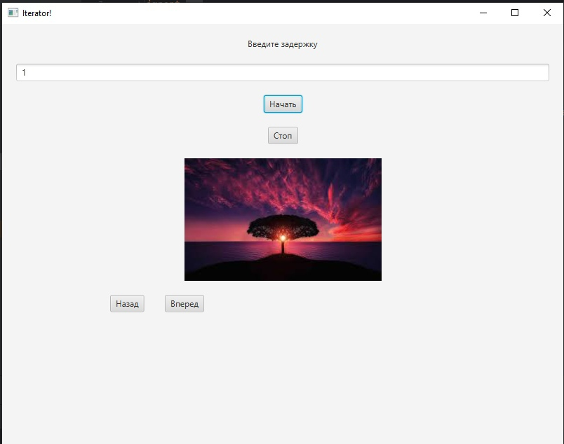
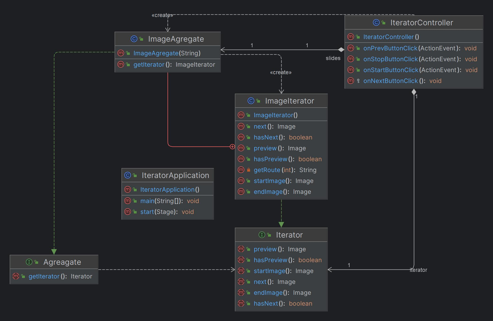

# java_lab_2
**Описание:** В данном репозитории представлена программа для создания слайд-шоу.
Для использования данного приложения вам необходимо:
* **Технологический стек**: Java. Данное ПО предназначено как автономное;
* **Статус**: v1.0;

**Скриншот рабочего окна приложения:**

## Архитектура
**Скриншот диаграммы классов:**

## Зависимости
Язык программироваия **Java**, комплект разработчика приложений **JDK 17**, а также инструментарий GUI **JavaFX**.
## Конфигурация
Для данного ПО не требуется специальная настройка
## Применение
Для использования калькулятора BMI вам необходимо:
* Занести значение вашей массы тела в поле для ввода массы тела;
* Занести ваш рост в поле для ввода роста;
* Нажать на кнопку *Рассчитать*;

После проделанных действий вам будет выведен результат *Индекса массы тела*, а также, исходя из этого результата, соответствие между массой и его ростом.
## Проблемы
Некрасивый интерфейс
## Получение справочной информации
Для получения любой справочной информации пишите главному разработчику [в телеграмм](https://t.me/Anion11)
## Приглашение к сотрудничеству
Для развития данного проекта требуется хороший и интуитивно понятный дизайн интерфейса, а также предложения для расширения возможностей приложения.
 
